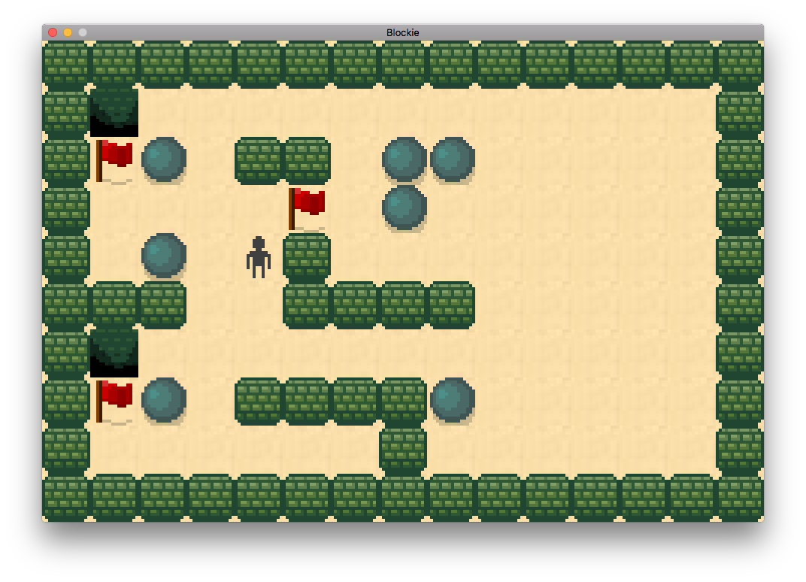

# Blockie

An unfinished game written in Lua made with the [LÖVE 2D game engine](https://love2d.org/).



## How to run the game

1. In order to run the game you need to install the LÖVE game engine which you can download from <https://love2d.org/>.
2. Download the game from GitHub by clicking on the `Clone or download` button on the right and then clicking `Download ZIP`.
3. Extract the contents of the archive and navigate inside the folder `blockie-master`.
4. Zip all the folder contents and rename the resulting ZIP archive to `Blockie.love`.
5. Double click on `Blockie.love` to launch the (unfinished) game.

If you have the LÖVE game engine already installed and available in your PATH you can start the game by navigating inside the `blockie-master` folder and running the following command in terminal:

```bash
love .
```

## License

This project is open source licensed under the BSD 3-Clause License. Please see the [LICENSE file](LICENSE.md) for more information.